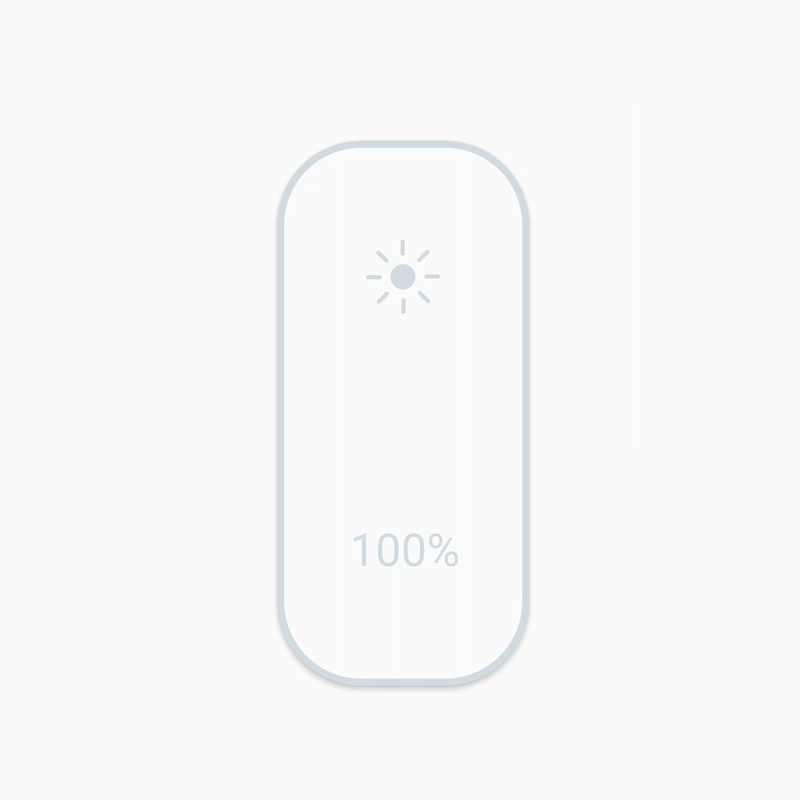
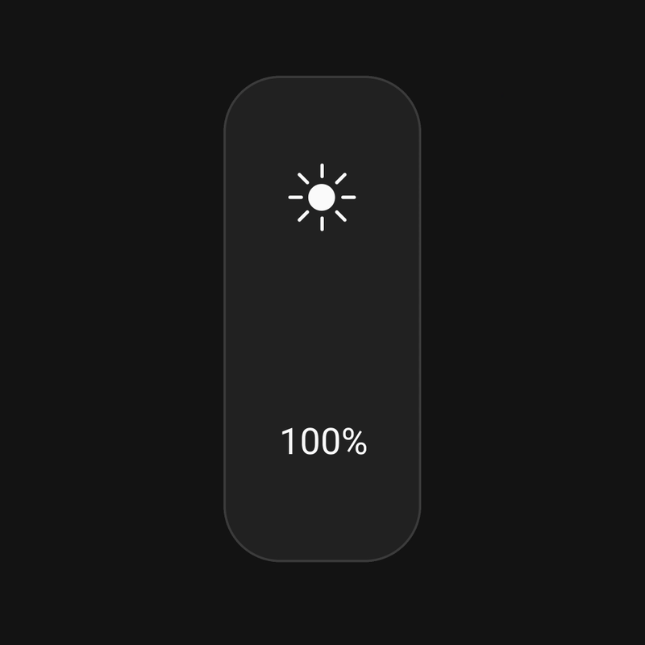

# IOSlider
[](https://android-arsenal.com/api?level=17#l17)
[](https://jitpack.io/#ErrorErrorError/IOSlider)

This is a customizable slider library for Android.

## Demo:
| |  |
|:---:|:---:|

### Design Credits:
Library design inspired by [JD](https://dribbble.com/shots/6315813-HomeApp-dark-light-mode)
 and [Eddy Gann](https://dribbble.com/shots/3728650-30-Brightness)

# Features:
- Supports LottieDrawable for animating the icon. Only LottieDrawable can be animated, but you could still set another drawable of your choice.
- Highly customizable.
- Animate the progress.
- More features coming soon. If you have any feature requests feel free to suggest.

# Compatibility:
Supports from API 17+

# Setup:
``` gradle
allprojects {
	repositories {
		...
		maven { url 'https://jitpack.io' }
	}
}

dependencies {
        implementation 'com.github.ErrorErrorError:IOSlider:1.2.0'
}
```
# Usage

### XML
``` XML
<com.errorerrorerror.ioslider.IOSlider
    android:id="@+id/slider"
    android:layout_width="180dp"
    android:layout_height="match_parent"
    app:activeTrackColor="@color/slider_active_track_color"
    app:inactiveTrackColor="@color/slider_active_track_color"
    app:strokeColor="@color/slider_active_track_color"
    app:strokeWidth="@android:color/transparent"
    app:icon="@raw/brightness_animation"
    app:iconColor="@color/slider_icon_color"
    app:iconSize="60dp"
    app:labelText=""
    app:labelColor="@color/slider_text_color"
    app:labelSize="@dimen/text_size"
    app:blendIconLabel="true"
    app:cornerRadius="@dimen/corner_radius"
    app:min="0"
    app:max="100"
    app:progress="50"
    app:touchMode="drag"
    app:iconTextVisibility="icontext" />
```
| Attributes | Description |
|:--|:--|
| activeTrackColor | Sets the active track color.|
| inactiveTrackColor | Sets the inactive track color.|
| strokeColor | Sets the stroke color. |
| strokeWidth | Sets the stroke width. |
| icon | Sets the icon drawable. If you want the icon to animate on progress, you can pass a Lottie JSON file and the icon will animate on progress. |
| iconColor | Sets the icon color. |
| iconSize | Sets the icon size. |
| labelText | Sets the text of the label. By default the label will show the percentage of the progress. |
| labelColor | Sets the text color. |
| labelSize | Sets the size of the text |
| blendIconLabel | Blends the text and the icon color to inactiveTrackColor whenever the progress draws under the icon and label. |
| cornerRadius | Sets the corner radius of the view. |
| min | Sets the lowest value for the progress. |
| max | Sets the maximum value for the progress. |
| progress | Sets the progress of the slider. |
| touchMode | Sets the way when the progress should change, either on touch, or on drag. |
| iconTextVisibility | Sets the visibility of the icon AND the order. If one option is shown, then it centers the view. |

### Dynamically
Few examples using IOSlider dynamically.
``` Java
binding.slider.setCornerRadius(30);
binding.slider.setActiveTrackColor(Color.RED);
binding.slider.setIcon(R.raw.brightness_animation);
binding.slider.setIconColor(Color.WHITE);
```
For more information read the documentation on the java methods [here](ioslider/src/main/java/com/errorerrorerror/ioslider/IOSlider.java).

#### Adding Listeners
Adding onProgressChanged listeners:
``` Java
binding.slider.addOnSliderChangeListener(new IOSlider.OnSliderChangeListener() {
    @Override
    public void onProgressChanged(IOSlider slider, int progress, boolean fromUser) {
                
    }
});
```

Adding onTouch listeners:
``` Java
binding.slider.addOnSliderTouchListener(new IOSlider.OnSliderTouchListener() {
    @Override
    public void onStartTrackingTouch(IOSlider slider) {
                
    }

    @Override
    public void onStopTrackingTouch(IOSlider slider) {

    }
});
```
# Contact
Feel free to reach out at Erikbautista15@gmail.com

# License
```
MIT License

Copyright (c) 2019 Erik Bautista

Permission is hereby granted, free of charge, to any person obtaining a copy
of this software and associated documentation files (the "Software"), to deal
in the Software without restriction, including without limitation the rights
to use, copy, modify, merge, publish, distribute, sublicense, and/or sell
copies of the Software, and to permit persons to whom the Software is
furnished to do so, subject to the following conditions:

The above copyright notice and this permission notice shall be included in all
copies or substantial portions of the Software.

THE SOFTWARE IS PROVIDED "AS IS", WITHOUT WARRANTY OF ANY KIND, EXPRESS OR
IMPLIED, INCLUDING BUT NOT LIMITED TO THE WARRANTIES OF MERCHANTABILITY,
FITNESS FOR A PARTICULAR PURPOSE AND NONINFRINGEMENT. IN NO EVENT SHALL THE
AUTHORS OR COPYRIGHT HOLDERS BE LIABLE FOR ANY CLAIM, DAMAGES OR OTHER
LIABILITY, WHETHER IN AN ACTION OF CONTRACT, TORT OR OTHERWISE, ARISING FROM,
OUT OF OR IN CONNECTION WITH THE SOFTWARE OR THE USE OR OTHER DEALINGS IN THE
SOFTWARE.
```